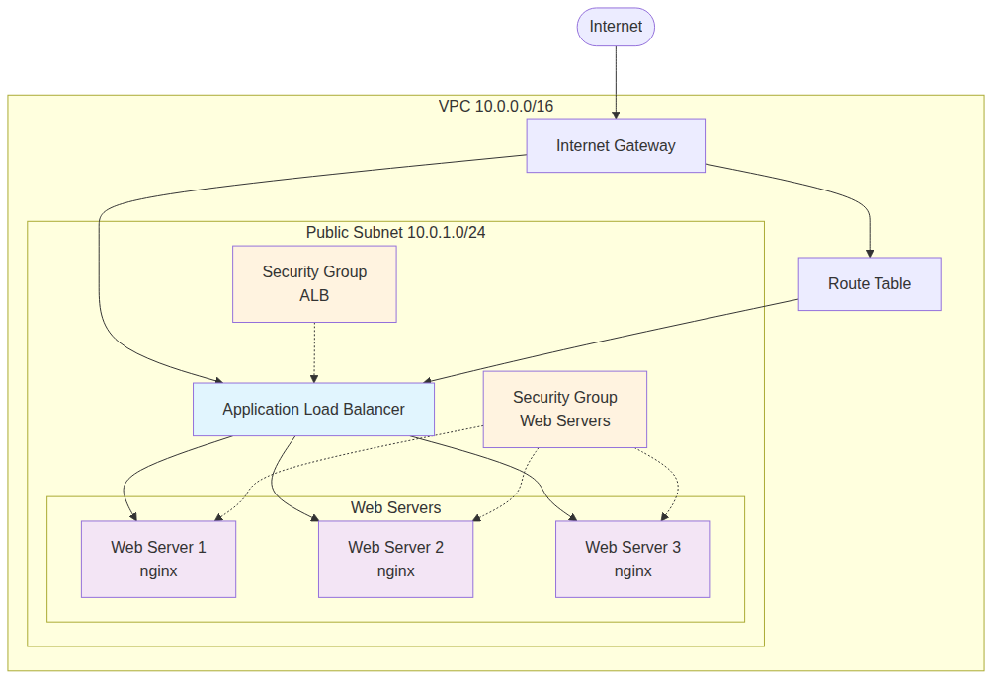
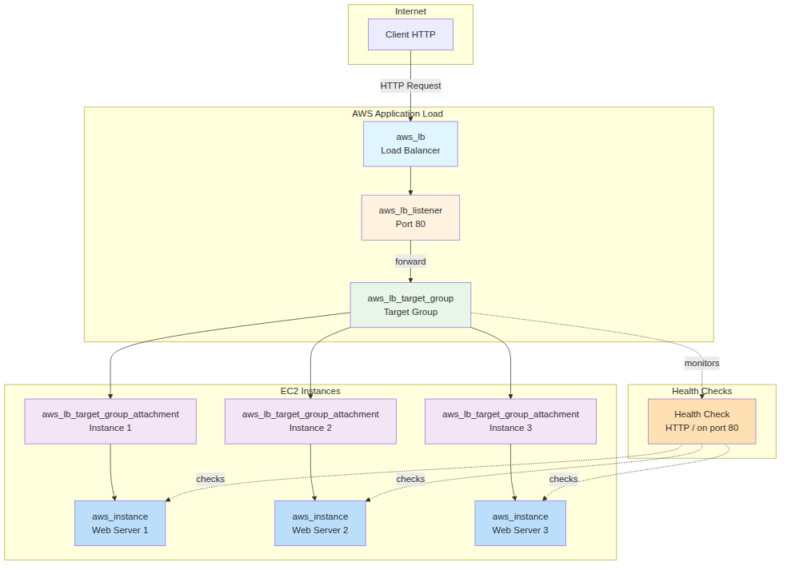

Dans cette huitième partie, nous allons explorer les concepts Terraform de `count` et `for_each` pour multiplier les ressources, et implémenter un load balancer pour assurer la haute disponibilité de notre application web.

## Concepts de multiplication des ressources

Terraform offre plusieurs mécanismes pour créer plusieurs instances d'une même ressource. Cette capacité est essentielle pour construire des infrastructures redondantes et hautement disponibles.

### Count vs for_each

Terraform propose deux approches principales pour créer plusieurs ressources :

**Count** : Crée un nombre défini d'instances indexées numériquement (0, 1, 2...). Idéal quand vous voulez simplement multiplier une ressource par un nombre.

**For_each** : Crée des instances basées sur un set ou une map, avec des clés nommées. Plus flexible pour des configurations variées et évite les problèmes de réindexation.

### Haute disponibilité et load balancing

La haute disponibilité consiste à distribuer la charge sur plusieurs serveurs pour éviter les points de défaillance unique. Si un serveur tombe en panne, les autres continuent de servir le trafic.

Un **load balancer** (répartiteur de charge) distribue intelligemment le trafic entrant entre plusieurs serveurs backend selon différents algorithmes (round-robin, least connections, etc.).

## Architecture cible

Notre objectif est de créer une infrastructure avec :
- **3 serveurs web** répartis sur 2 zones de disponibilité
- **2 subnets publics** dans des AZ différentes (exigence AWS pour l'ALB)
- Un **Application Load Balancer (ALB)** automatiquement créé si le nombre de serveurs > 1
- **Target Group** pour gérer la santé des serveurs
- **Health checks** automatiques
- Configuration dynamique basée sur le nombre d'instances

**Note importante** : AWS exige qu'un Application Load Balancer soit déployé dans au minimum 2 zones de disponibilité. Cette architecture reflète cette contrainte en créant 2 subnets publics.



## Implémentation avec count

Commençons par modifier notre configuration pour utiliser `count` et créer plusieurs serveurs web.

### Ajout des variables de configuration

Modifiez le fichier `variables.tf` pour ajouter les nouvelles variables :

```coffee
variable "instance_count" {
  description = "Number of web server instances"
  type        = number
  default     = 3
}

variable "public_subnet_cidr_2" {
  description = "CIDR block for second public subnet (required for ALB)"
  type        = string
  default     = "10.0.2.0/24"
}

variable "ssh_key_path" {
  description = "Path to SSH private key"
  type        = string
  default     = "~/.ssh/id_terraform"
}

variable "feature_name" {
  description = "Name of the feature being tested"
  type        = string
  default     = "load-balancer"
}
```


**Important** : La variable `public_subnet_cidr_2` est nécessaire car AWS exige qu'un Application Load Balancer soit déployé dans **au minimum 2 zones de disponibilité différentes** pour garantir la haute disponibilité. Nous devons donc créer un second subnet public.

### Modification de webserver.tf avec count

Transformons notre instance unique en plusieurs instances avec `count` et user-data :

```coffee
# Data source pour l'AMI Ubuntu standard
data "aws_ami" "ubuntu" {
  most_recent = true
  owners      = ["099720109477"] # Canonical

  filter {
    name   = "name"
    values = ["ubuntu/images/hvm-ssd/ubuntu-jammy-22.04-amd64-server-*"]
  }

  filter {
    name   = "virtualization-type"
    values = ["hvm"]
  }
}

# Template pour user-data
data "template_file" "user_data" {
  count = var.instance_count
  
  template = <<-EOF
#!/bin/bash

# Mettre à jour le système
apt-get update

# Créer l'utilisateur et configurer SSH
if ! id "terraform" &>/dev/null; then
  useradd -m -s /bin/bash terraform
  usermod -aG sudo terraform
  echo 'terraform ALL=(ALL) NOPASSWD:ALL' >> /etc/sudoers
fi

# Créer le répertoire .ssh
mkdir -p /home/terraform/.ssh
chmod 700 /home/terraform/.ssh

# Ajouter la clé publique SSH
echo "${ssh_public_key}" > /home/terraform/.ssh/authorized_keys
chmod 600 /home/terraform/.ssh/authorized_keys
chown -R terraform:terraform /home/terraform/.ssh

# Installer et configurer nginx
apt-get install -y nginx
systemctl start nginx
systemctl enable nginx

# Créer la page d'accueil avec numéro de serveur
echo '<h1>Server ${server_number} - Feature: ${feature_name} (${workspace})</h1>' > /var/www/html/index.html
echo '<p>Instance ID: ${instance_id}</p>' >> /var/www/html/index.html
echo '<p>Load balancer avec user-data</p>' >> /var/www/html/index.html

echo "Configuration serveur ${server_number} terminée avec user-data"
EOF

  vars = {
    ssh_public_key = file("${var.ssh_key_path}.pub")
    feature_name   = var.feature_name
    workspace      = terraform.workspace
    server_number  = count.index + 1
    instance_id    = count.index
  }
}

# Instances EC2 avec count et user-data
resource "aws_instance" "web_server" {
  count                  = var.instance_count
  ami                    = data.aws_ami.ubuntu.id
  instance_type          = var.instance_type
  subnet_id              = aws_subnet.public.id
  vpc_security_group_ids = [aws_security_group.web_servers.id]
  user_data              = data.template_file.user_data[count.index].rendered

  tags = {
    Name      = "${terraform.workspace}-web-server-${count.index + 1}"
    Workspace = terraform.workspace
    Feature   = var.feature_name
    Server    = "web-${count.index + 1}"
  }
}
```


### Modification de l'infrastructure VPC

Avant de configurer les security groups, nous devons modifier `vpc.tf` pour ajouter un second subnet public requis par l'ALB. Ajoutez les ressources suivantes à votre fichier `vpc.tf` :

```coffee
# Data source pour les zones de disponibilité
data "aws_availability_zones" "available" {
  state = "available"
}

# Subnet public 2 (pour ALB multi-AZ)
resource "aws_subnet" "public_2" {
  vpc_id                  = aws_vpc.main.id
  cidr_block              = var.public_subnet_cidr_2
  availability_zone       = data.aws_availability_zones.available.names[1]
  map_public_ip_on_launch = true

  tags = {
    Name      = "${terraform.workspace}-public-subnet-2"
    Workspace = terraform.workspace
    Feature   = var.feature_name
  }
}

# Association subnet 2 avec route table
resource "aws_route_table_association" "public_2" {
  subnet_id      = aws_subnet.public_2.id
  route_table_id = aws_route_table.public.id
}
```

**Pourquoi un second subnet ?**

AWS impose qu'un Application Load Balancer soit distribué sur **au minimum 2 zones de disponibilité** différentes. Cette exigence garantit :
- **Haute disponibilité** : Si une AZ tombe en panne, l'ALB continue à fonctionner
- **Répartition de charge géographique** : Le trafic est distribué entre les zones
- **Respect des SLA AWS** : AWS ne garantit ses SLA que si cette condition est respectée

### Gestion des security groups

Nous devons séparer les security groups pour l'ALB et les serveurs web. Modifiez `vpc.tf` :

```coffee
# Security Group pour les serveurs web
resource "aws_security_group" "web_servers" {
  name        = "${terraform.workspace}-web-servers"
  description = "Security group for web servers"
  vpc_id      = aws_vpc.main.id

  # SSH depuis l'extérieur (pour administration)
  ingress {
    from_port   = 22
    to_port     = 22
    protocol    = "tcp"
    cidr_blocks = ["0.0.0.0/0"]
  }

  # HTTP depuis l'ALB seulement (si plusieurs instances)
  dynamic "ingress" {
    for_each = var.instance_count > 1 ? [1] : []
    content {
      from_port       = 80
      to_port         = 80
      protocol        = "tcp"
      security_groups = [aws_security_group.alb[0].id]
    }
  }

  # HTTP direct si une seule instance
  dynamic "ingress" {
    for_each = var.instance_count == 1 ? [1] : []
    content {
      from_port   = 80
      to_port     = 80
      protocol    = "tcp"
      cidr_blocks = ["0.0.0.0/0"]
    }
  }

  egress {
    from_port   = 0
    to_port     = 0
    protocol    = "-1"
    cidr_blocks = ["0.0.0.0/0"]
  }

  tags = {
    Name      = "${terraform.workspace}-web-servers-sg"
    Workspace = terraform.workspace
    Feature   = var.feature_name
  }
}

# Security Group pour l'ALB (conditionnel)
resource "aws_security_group" "alb" {
  count       = var.instance_count > 1 ? 1 : 0
  name        = "${terraform.workspace}-alb-sg"
  description = "Security group for Application Load Balancer"
  vpc_id      = aws_vpc.main.id

  ingress {
    from_port   = 80
    to_port     = 80
    protocol    = "tcp"
    cidr_blocks = ["0.0.0.0/0"]
  }

  ingress {
    from_port   = 443
    to_port     = 443
    protocol    = "tcp"
    cidr_blocks = ["0.0.0.0/0"]
  }

  egress {
    from_port   = 0
    to_port     = 0
    protocol    = "-1"
    cidr_blocks = ["0.0.0.0/0"]
  }

  tags = {
    Name      = "${terraform.workspace}-alb-sg"
    Workspace = terraform.workspace
    Feature   = var.feature_name
  }
}
```

## Configuration du Load Balancer

Allons lire la documentation des resources autour de Application Load Balancer (Amazon LoadBalancer) sur le registry terraform : 

https://registry.terraform.io/providers/hashicorp/aws/latest/docs/resources/lb

### Composants d'un Application Load Balancer

Un ALB est composé de plusieurs ressources Terraform interconnectées :



**Ressources principales :**
- **aws_lb** : Le load balancer principal qui reçoit le trafic
- **aws_lb_listener** : Écoute sur un port spécifique (80, 443) et définit les règles de routage
- **aws_lb_target_group** : Groupe logique qui contient les instances backend
- **aws_lb_target_group_attachment** : Lie chaque instance EC2 au target group
- **Health Checks** : Vérifications automatiques de santé des instances

**Flux de trafic :**
1. Client → ALB (port 80)
2. ALB → Listener (règles de routage)
3. Listener → Target Group (forward)
4. Target Group → Instances saines (round-robin)

### Exigence multi-AZ pour l'ALB

**Important :** Un Application Load Balancer AWS nécessite au minimum **deux subnets dans des zones de disponibilité différentes** pour garantir la haute disponibilité. C'est pourquoi notre architecture comprend deux subnets publics (`public_subnet_1` et `public_subnet_2`) situés dans des AZ distinctes.

Cette exigence assure que si une zone de disponibilité entière devient indisponible, l'ALB peut continuer à fonctionner via l'autre zone. AWS refuse la création d'un ALB avec un seul subnet.

Créons un nouveau fichier `loadbalancer.tf` pour gérer l'ALB :

```coffee
# Application Load Balancer (conditionnel)
resource "aws_lb" "main" {
  count              = var.instance_count > 1 ? 1 : 0
  name               = "${terraform.workspace}-alb"
  internal           = false
  load_balancer_type = "application"
  security_groups    = [aws_security_group.alb[0].id]
  subnets           = [aws_subnet.public.id, aws_subnet.public_2.id]

  enable_deletion_protection = false

  tags = {
    Name        = "${terraform.workspace}-alb"
    Workspace   = terraform.workspace
    Feature     = var.feature_name
    Environment = "load-balancer"
  }
}

# Target Group pour les serveurs web
resource "aws_lb_target_group" "web_servers" {
  count    = var.instance_count > 1 ? 1 : 0
  name     = "${terraform.workspace}-web-tg"
  port     = 80
  protocol = "HTTP"
  vpc_id   = aws_vpc.main.id

  health_check {
    enabled             = true
    healthy_threshold   = 2
    interval            = 30
    matcher             = "200"
    path                = "/"
    port                = "traffic-port"
    protocol            = "HTTP"
    timeout             = 5
    unhealthy_threshold = 2
  }

  tags = {
    Name      = "${terraform.workspace}-web-tg"
    Workspace = terraform.workspace
    Feature   = var.feature_name
  }
}

# Attachement des instances au Target Group
resource "aws_lb_target_group_attachment" "web_servers" {
  count            = var.instance_count > 1 ? var.instance_count : 0
  target_group_arn = aws_lb_target_group.web_servers[0].arn
  target_id        = aws_instance.web_server[count.index].id
  port             = 80
}

# Listener pour l'ALB
resource "aws_lb_listener" "web" {
  count             = var.instance_count > 1 ? 1 : 0
  load_balancer_arn = aws_lb.main[0].arn
  port              = "80"
  protocol          = "HTTP"

  default_action {
    type             = "forward"
    target_group_arn = aws_lb_target_group.web_servers[0].arn
  }

  tags = {
    Name      = "${terraform.workspace}-web-listener"
    Workspace = terraform.workspace
    Feature   = var.feature_name
  }
}
```

## Sorties adaptatives

Pour une meilleure organisation, créons un fichier `outputs.tf` dédié qui rassemble toutes les sorties du projet :

```coffee
# Outputs réseau
output "vpc_id" {
  description = "ID of the VPC"
  value       = aws_vpc.main.id
}

output "subnet_id" {
  description = "ID of the public subnet"
  value       = aws_subnet.public.id
}

# Outputs pour les instances
output "instance_ids" {
  description = "IDs of the web server instances"
  value       = aws_instance.web_server[*].id
}

output "instance_public_ips" {
  description = "Public IP addresses of the web server instances"
  value       = aws_instance.web_server[*].public_ip
}

# Output conditionnel pour l'ALB
output "load_balancer_dns" {
  description = "DNS name of the load balancer (if enabled)"
  value       = var.instance_count > 1 ? aws_lb.main[0].dns_name : null
}

# URL de l'application (ALB ou première instance)
output "web_url" {
  description = "URL to access the web application"
  value = var.instance_count > 1 ? "http://${aws_lb.main[0].dns_name}" : "http://${aws_instance.web_server[0].public_ip}"
}

# URLs de toutes les instances (pour debug)
output "individual_server_urls" {
  description = "URLs of individual servers"
  value = [
    for instance in aws_instance.web_server : 
    "http://${instance.public_ip}"
  ]
}
```

N'oubliez pas de supprimer les outputs de `webserver.tf` et `vpc.tf`.

## Concepts avancés : for_each

Bien que nous utilisions `count` dans cet exemple, `for_each` offre plus de flexibilité. 

Voici en particulier un exemple alternatif ou les serveurs ne sont pas des instances indistinctes mais des entités nomméés et stables. Cet aspect est important les instances sont stateful et pas nécessairement identiques (ce qui n'est pas notre cas ici).

```coffee
# Configuration avec for_each (exemple alternatif)
variable "web_servers" {
  description = "Configuration for web servers"
  type = map(object({
    instance_type = string
    name_suffix   = string
  }))
  default = {
    "web1" = {
      instance_type = "t2.micro"
      name_suffix   = "primary"
    }
    "web2" = {
      instance_type = "t2.micro"
      name_suffix   = "secondary"
    }
    "web3" = {
      instance_type = "t2.micro"
      name_suffix   = "tertiary"
    }
  }
}

# Instances avec for_each (commenté pour cet exemple)
/*
resource "aws_instance" "web_server_foreach" {
  for_each               = var.web_servers
  ami                    = data.aws_ami.custom_ubuntu.id
  instance_type          = each.value.instance_type
  subnet_id              = aws_subnet.public.id
  vpc_security_group_ids = [aws_security_group.web_servers.id]

  tags = {
    Name      = "${terraform.workspace}-${each.key}-${each.value.name_suffix}"
    Workspace = terraform.workspace
    Feature   = var.feature_name
    ServerKey = each.key
  }
}
*/
```

## Déploiement et test

### Fichiers de variables pour test

Créez différents fichiers de variables pour tester les configurations :

**single-server.tfvars** (un seul serveur) :
```coffee
aws_region           = "eu-west-3"
aws_profile          = "default"
vpc_cidr             = "10.0.0.0/16"
public_subnet_cidr   = "10.0.1.0/24"
instance_type        = "t2.micro"
ssh_key_path         = "~/.ssh/id_terraform"
feature_name         = "single-server-test"
instance_count       = 1
```

**multi-server.tfvars** (serveurs multiples avec ALB) :
```coffee
aws_region           = "eu-west-3"
aws_profile          = "default"
vpc_cidr             = "10.0.0.0/16"
public_subnet_cidr   = "10.0.1.0/24"
public_subnet_cidr_2 = "10.0.2.0/24"
instance_type        = "t2.micro"
ssh_key_path         = "~/.ssh/id_terraform"
feature_name         = "load-balanced-cluster"
instance_count       = 3
```

### Commandes de déploiement

```bash
# Déploiement avec un seul serveur
terraform workspace new single-server
terraform plan -var-file="single-server.tfvars" -out=single.tfplan
terraform apply single.tfplan

# Test de l'application
curl $(terraform output -raw web_url)

# Passage à plusieurs serveurs
terraform workspace new multi-server
terraform plan -var-file="multi-server.tfvars" -out=multi.tfplan
terraform apply multi.tfplan
```

## Conclusion

Cette partie vous a montré comment utiliser `count` pour multiplier les ressources et implémenter un load balancer pour la haute disponibilité. Nous avons créé une infrastructure qui s'adapte automatiquement au nombre d'instances : une instance unique sans load balancer, ou plusieurs instances derrière un ALB.

Points clés à retenir :
- `count` permet de créer facilement plusieurs instances d'une ressource
- `for_each` offre plus de flexibilité pour des configurations variées
- Un load balancer améliore la disponibilité et la performance
- **AWS exige 2+ zones de disponibilité pour l'ALB** : toujours prévoir plusieurs subnets
- La configuration conditionnelle permet une infrastructure adaptative
- Les health checks automatiques garantissent la fiabilité du service

Dans la prochaine partie, nous explorerons les modules Terraform pour réutiliser et organiser notre code de manière modulaire.