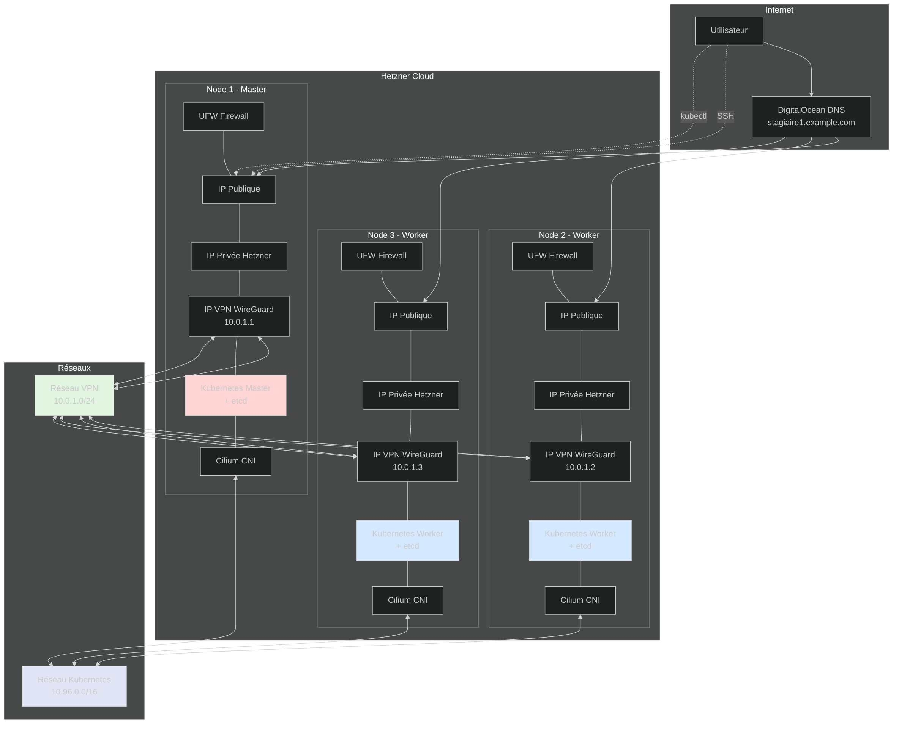

Ce TP déploie un cluster Kubernetes multi-nœuds sur Scaleway en utilisant OpenTofu (fork open-source de Terraform). L'infrastructure inclut un réseau VPN sécurisé avec WireGuard, un cluster etcd séparé, et la configuration automatique de Kubernetes avec Cilium comme CNI.

## Vue d'ensemble de l'architecture

### Schéma de l'infrastructure



> **Note :** Le diagramme source est disponible dans le fichier `images/architecture.mmd` et peut être modifié puis recompilé avec la commande :  
> `mmdc -i images/architecture.mmd -o images/architecture.png -t dark -b transparent -s 2 -w 1200`

## Structure des modules

Le projet utilise une organisation modulaire simplifiée où tous les modules sont regroupés dans un dossier `modules/` unique. Cette approche facilite la navigation et la maintenance :

```sh
270_tp_kube_tofu/
├── tp_kube_tofu.md             # Ce document
├── main.tf                     # Configuration principale
├── variables.tf                # Variables globales
├── versions.tf                 # Versions des providers
├── images/                     # Diagrammes d'architecture
│   ├── architecture.mmd        # Source Mermaid
│   └── architecture.png        # Diagramme compilé
└── modules/                    # Tous les modules Terraform
    ├── scaleway/               # Provider Scaleway Cloud
    ├── digitalocean/           # Configuration DNS
    ├── wireguard/              # VPN WireGuard
    ├── ufw/                    # Pare-feu UFW
    ├── etcd/                   # Cluster etcd
    ├── kubernetes/             # Installation Kubernetes
    ├── swap/                   # Configuration du swap
    ├── nginx/                  # Déploiement nginx
    └── file_output/            # Génération de fichiers
```

## Ordre de déploiement

Les modules sont déployés dans cet ordre précis pour respecter les dépendances :

1. **scaleway** : Création des serveurs virtuels sur Scaleway
2. **swap** : Configuration du swap (compatible avec Kubernetes)
3. **digitalocean** : Configuration des enregistrements DNS
4. **wireguard** : Établissement du réseau VPN sécurisé
5. **ufw** : Configuration des règles de pare-feu
6. **etcd** : Déploiement du cluster etcd
7. **kubernetes** : Installation et configuration du cluster
8. **file_output** : Génération des fichiers de configuration
9. **nginx** : Déploiement de l'application nginx sur Kubernetes

## Configuration requise

### Prérequis

1. **OpenTofu** ou **Terraform** >= 1.0
2. **CLI Scaleway** configuré avec un profil
3. **Compte DigitalOcean** avec un token API (pour DNS)
4. **Clés SSH** configurées dans Scaleway
5. **Domaine** avec DNS géré par DigitalOcean

### Variables principales

```hcl
# Nombre de nœuds du cluster
node_count = 3

# Nombre de nœuds etcd (doit être impair)
etcd_node_count = 3

# Domaine et sous-domaine
domain = "example.com"
subdomain = "stagiaire1"

# Format des noms d'hôtes
hostname_format = "kube-stagiaire1%d"

# Réseaux
overlay_cidr = "10.96.0.0/16"  # Réseau pods Kubernetes

# Configuration Scaleway
scaleway_zone = "fr-par-1"         # Paris, France
scaleway_type = "DEV1-M"           # Type d'instance (2 vCPU, 4GB RAM)
scaleway_image = "ubuntu_jammy"    # Image Ubuntu 22.04 (Jammy)
scaleway_profile = "default"       # Profil CLI Scaleway
```

## Déploiement

### 0. Configuration préalable de Scaleway CLI

Avant de déployer, configurez la CLI Scaleway :

```bash
# Installer la CLI Scaleway
curl -s https://raw.githubusercontent.com/scaleway/scaleway-cli/master/scripts/get.sh | sh

# Configurer le profil (nécessite un token API Scaleway)
scw init

# Vérifier la configuration
scw config list

# Créer et configurer une clé SSH
scw account ssh-key create name=id_stagiaire public-key="$(cat ~/.ssh/id_rsa.pub)"
```

### 1. Configuration des variables

Créez un fichier `terraform.tfvars` :

```hcl
# Configuration Scaleway (authentification via CLI profile)
scaleway_profile = "default"
scaleway_ssh_keys = ["nom-de-votre-cle-ssh"]

# Configuration DNS
digitalocean_token = "votre-token-digitalocean"
domain = "votre-domaine.com"
subdomain = "votre-sous-domaine"
```

### 2. Initialisation et déploiement

```bash
# Initialiser OpenTofu/Terraform
tofu init

# Vérifier le plan
tofu plan

# Déployer l'infrastructure
tofu apply

# Récupérer la configuration kubectl
scp root@<IP-MASTER>:/etc/kubernetes/admin.conf ~/.kube/config-scaleway
export KUBECONFIG=~/.kube/config-scaleway

# Vérifier le cluster
kubectl get nodes
kubectl get pods -A
```

### 3. Déploiement d'applications

Le module `nginx` déploie automatiquement un exemple nginx :

```bash
# Vérifier le déploiement nginx
kubectl get deployment nginx-deployment
kubectl get service nginx-service
kubectl get pods -l app=nginx
```

## Composants déployés

### Infrastructure

- **3 serveurs** Ubuntu 22.04 (Jammy) sur Scaleway
- **Instances DEV1-M** (2 vCPU, 4GB RAM) pour tous les nœuds
- **VPN WireGuard** pour sécuriser les communications
- **Pare-feu UFW** avec règles restrictives

### Kubernetes

- **Kubernetes** dernière version stable
- **etcd** cluster à 3 nœuds pour la haute disponibilité
- **Cilium** comme CNI (Container Network Interface)
- **CoreDNS** pour la résolution DNS interne
- **Metrics Server** pour les métriques

### Sécurité

- Communication chiffrée via WireGuard
- Pare-feu UFW restrictif
- API Kubernetes accessible uniquement via VPN
- etcd sécurisé avec TLS

## Module de déploiement nginx

Le module `nginx` utilise le provider Kubernetes pour déployer :

- **Déploiement standard** : nginx avec 3 réplicas et configuration de ressources
- **Déploiement personnalisé** : nginx avec page d'accueil custom via ConfigMap
- **Services** : ClusterIP pour accès interne et LoadBalancer pour accès externe
- **Sondes de santé** : liveness et readiness probes
- **Namespace** : namespace dédié (optionnel)

Ce module démontre l'utilisation du provider Kubernetes pour gérer des ressources directement depuis OpenTofu/Terraform.

## Nettoyage

Pour détruire l'infrastructure :

```bash
# Détruire toutes les ressources
tofu destroy

# Nettoyer les fichiers générés
rm -f hosts kubeconfig.yaml
```

## Points d'attention

1. **Coûts** : Les serveurs Scaleway sont facturés à l'heure
2. **Authentification** : Le provider Scaleway utilise le profil CLI configuré
3. **DNS** : La propagation DNS peut prendre quelques minutes
4. **Firewall** : Seuls les ports nécessaires sont ouverts
5. **Swap** : Le swap est maintenant supporté par Kubernetes (configuré via kubelet)
6. **Backups** : Pensez à sauvegarder les données etcd pour la production

## Dépannage

### Problèmes courants

1. **Connexion SSH impossible** : Vérifiez que votre clé SSH est bien configurée dans Scaleway
2. **Authentification Scaleway** : Vérifiez la configuration de votre CLI avec `scw config list`
3. **DNS non résolu** : Attendez la propagation DNS (jusqu'à 5 minutes)
4. **Kubernetes non accessible** : Vérifiez que WireGuard est actif sur tous les nœuds
5. **Pods en erreur** : Vérifiez les logs avec `kubectl logs`

### Commandes utiles

```bash
# Vérifier l'état du cluster
kubectl cluster-info
kubectl get nodes -o wide

# Vérifier WireGuard
ssh root@<NODE-IP> "wg show"

# Vérifier etcd
ssh root@<NODE-IP> "etcdctl member list"

# Logs Kubernetes
kubectl logs -n kube-system <pod-name>
```