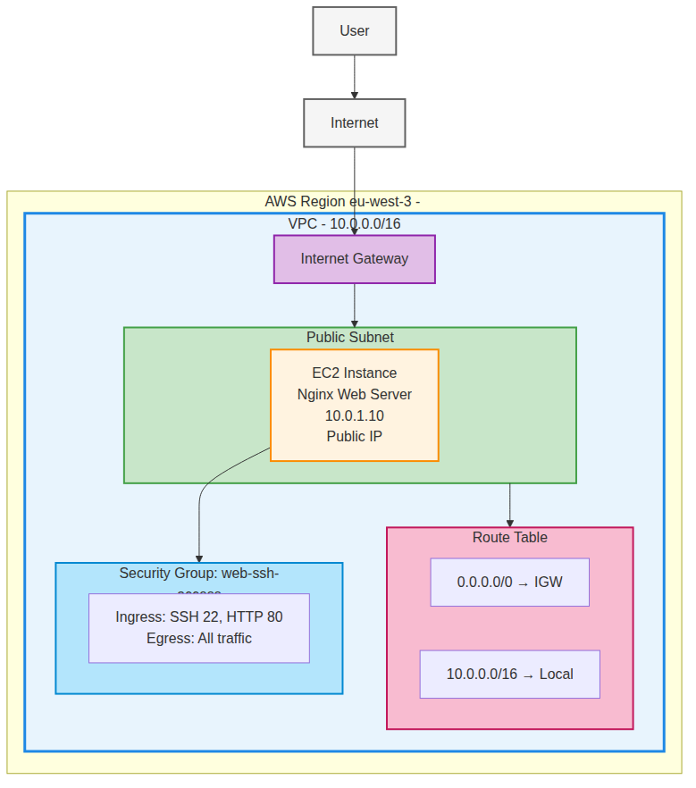

Dans cette quatrième partie, nous allons découvrir les concepts fondamentaux des VPC (Virtual Private Cloud) AWS en créant une architecture réseau simple. Nous reprendrons notre serveur web de la partie 3 mais cette fois-ci dans un VPC personnalisé.

## Qu'est-ce qu'un VPC AWS ?

Un VPC (Virtual Private Cloud) est un réseau virtuel dédié à votre compte AWS. C'est un environnement isolé logiquement du reste du cloud AWS où vous pouvez lancer vos ressources dans un réseau virtuel que vous définissez. Contrairement aux parties précédentes où nous utilisions le VPC par défaut d'AWS, nous allons maintenant créer et configurer notre propre VPC.

### Avantages d'un VPC personnalisé

Créer son propre VPC offre plusieurs avantages par rapport à l'utilisation du VPC par défaut. Vous avez un contrôle total sur l'architecture réseau, vous pouvez définir vos propres plages d'adresses IP et configurer les tables de routage selon vos besoins. Cela permet également une meilleure sécurité grâce à l'isolation réseau et la possibilité de créer des environnements multi-tiers.

## Architecture de notre VPC simple



Notre architecture comprend les éléments essentiels d'un VPC fonctionnel. Nous créons un VPC avec un seul subnet public contenant notre serveur web Nginx, une Internet Gateway pour l'accès Internet, une table de routage pour diriger le trafic et un Security Group pour contrôler l'accès.

## Construction progressive du VPC

Nous allons construire notre infrastructure bloc par bloc pour bien comprendre chaque composant et son rôle dans l'architecture réseau.

### Étape 1 : Création du VPC de base

Commencez par reprendre la partie 3 (en ayant commité le résultat). Modifiez le fichier `main.tf` et ajoutez le bloc VPC :

```coffee
# VPC
resource "aws_vpc" "main" {
  cidr_block           = "10.0.0.0/16"
  enable_dns_hostnames = true
  enable_dns_support   = true

  tags = {
    Name = "main-vpc"
  }
}
```

Le bloc VPC définit notre réseau virtuel privé avec une plage d'adresses IP de 10.0.0.0/16, ce qui nous donne 65 536 adresses IP disponibles. Les paramètres `enable_dns_hostnames` et `enable_dns_support` activent la résolution DNS dans le VPC, permettant aux instances d'avoir des noms DNS.

### Internet Gateway

Ajoutez l'Internet Gateway pour permettre l'accès Internet :

```coffee
# Internet Gateway
resource "aws_internet_gateway" "main" {
  vpc_id = aws_vpc.main.id

  tags = {
    Name = "main-igw"
  }
}
```

L'Internet Gateway (IGW) est le composant qui permet aux ressources du VPC de communiquer avec Internet. Elle est attachée au VPC via `vpc_id` et constitue le point d'entrée et de sortie pour tout le trafic Internet.

### Subnet public

Créez maintenant un subnet public pour héberger notre serveur web :

```coffee
# Subnet public
resource "aws_subnet" "public" {
  vpc_id                  = aws_vpc.main.id
  cidr_block              = "10.0.1.0/24"
  map_public_ip_on_launch = true

  tags = {
    Name = "public-subnet"
  }
}
```

Le subnet utilise une partie de la plage IP du VPC (10.0.1.0/24 = 256 adresses). Le paramètre `map_public_ip_on_launch` fait que les instances lancées dans ce subnet reçoivent automatiquement une adresse IP publique.

### Table de routage

Ajoutez la table de routage qui définit comment le trafic est acheminé/routé :

```coffee
# Route table
resource "aws_route_table" "public" {
  vpc_id = aws_vpc.main.id

  route {
    cidr_block = "0.0.0.0/0"
    gateway_id = aws_internet_gateway.main.id
  }

  tags = {
    Name = "public-route-table"
  }
}
```

Cette table de routage contient une route par défaut (0.0.0.0/0) qui dirige tout le trafic Internet vers l'Internet Gateway. AWS ajoute automatiquement une route locale pour le trafic interne au VPC.

### Association subnet-route table

Associez le subnet à la table de routage :

```coffee
# Association subnet avec route table
resource "aws_route_table_association" "public" {
  subnet_id      = aws_subnet.public.id
  route_table_id = aws_route_table.public.id
}
```

Cette association indique que le trafic du subnet public doit utiliser la table de routage publique pour déterminer sa destination.

### Security Group

Ajoutez le Security Group pour contrôler l'accès réseau :

```hcl
# Security Group
resource "aws_security_group" "web_ssh_access" {
  name        = "web-ssh-access"
  description = "Allow SSH and HTTP access"
  vpc_id      = aws_vpc.main.id

  ingress {
    from_port   = 22
    to_port     = 22
    protocol    = "tcp"
    cidr_blocks = ["0.0.0.0/0"]
  }

  ingress {
    from_port   = 80
    to_port     = 80
    protocol    = "tcp"
    cidr_blocks = ["0.0.0.0/0"]
  }

  egress {
    from_port   = 0
    to_port     = 0
    protocol    = "-1"
    cidr_blocks = ["0.0.0.0/0"]
  }

  tags = {
    Name = "Web and SSH Access"
  }
}
```

Notez que le Security Group doit spécifier `vpc_id` car il sera créé dans notre VPC personnalisé et non dans le VPC par défaut. Les règles sont identiques à celles des parties précédentes.

### Étape 8 : Instance EC2

Finalement, ajoutez l'instance EC2 avec le provisioner Nginx :

```hcl
# Instance EC2
resource "aws_instance" "web_server" {
  ami                    = data.aws_ami.custom_ubuntu.id
  instance_type          = "t2.micro"
  subnet_id              = aws_subnet.public.id
  vpc_security_group_ids = [aws_security_group.web_ssh_access.id]

  connection {
    type        = "ssh"
    user        = "root"
    private_key = file("~/.ssh/id_terraform")
    host        = self.public_ip
  }

  provisioner "remote-exec" {
    inline = [
      "apt-get update",
      "apt-get install -y nginx",
      "systemctl start nginx",
      "systemctl enable nginx",
      "echo '<h1>Hello from VPC!</h1>' > /var/www/html/index.html",
      "echo 'Nginx installed in VPC'"
    ]
  }

  tags = {
    Name = "nginx-web-server-vpc"
  }
}
```

L'instance spécifie maintenant explicitement `subnet_id` pour la placer dans notre subnet public personnalisé. Le provisioner installe Nginx comme dans la partie 3.

### Étape 9 : Outputs

Ajoutez les outputs pour afficher les informations importantes :

```hcl
# Outputs
output "vpc_id" {
  value = aws_vpc.main.id
}

output "subnet_id" {
  value = aws_subnet.public.id
}

output "instance_id" {
  value = aws_instance.web_server.id
}

output "instance_public_ip" {
  value = aws_instance.web_server.public_ip
}

output "web_url" {
  value = "http://${aws_instance.web_server.public_ip}"
}
```

Ces outputs vous permettent de voir les IDs des ressources créées et l'URL pour accéder au serveur web.

## Déploiement et vérification

Déployez l'infrastructure avec les commandes habituelles :

```bash
terraform init
terraform plan
terraform apply
```

Une fois le déploiement terminé, vous pouvez accéder au serveur web via l'URL affichée dans les outputs. La page affichera "Hello from VPC!" confirmant que le serveur fonctionne dans votre VPC personnalisé.

## Différences avec le VPC par défaut

Notre VPC personnalisé diffère du VPC par défaut sur plusieurs points importants. Nous contrôlons entièrement la configuration réseau, nous définissons nos propres plages IP et nous créons explicitement tous les composants (IGW, subnets, route tables). Cela nous donne une meilleure visibilité et un contrôle total sur l'architecture.

## Bonnes pratiques VPC

Lors de la création d'un VPC, choisissez soigneusement votre plage CIDR en évitant les conflits avec d'autres réseaux. Activez toujours les fonctionnalités DNS pour une meilleure connectivité. Documentez votre architecture réseau et utilisez des tags cohérents pour faciliter la gestion.

## Conclusion

Cette introduction aux VPC vous a montré comment créer une architecture réseau personnalisée sur AWS. Dans la partie suivante, nous étendrons cette base pour créer une architecture multi-AZ avec subnets privés et NAT Gateways pour une haute disponibilité et une sécurité renforcée.