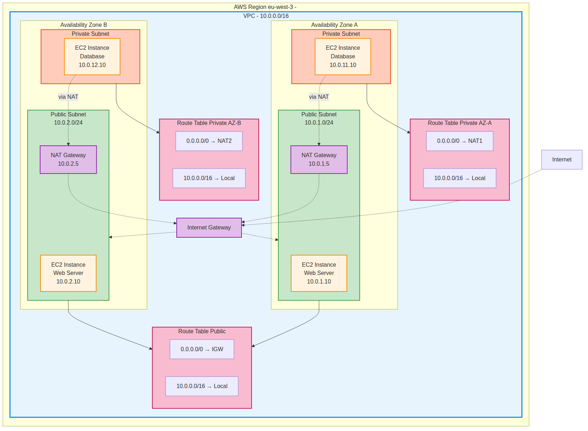

Dans cette quatrième partie, nous allons explorer en profondeur le concept de VPC (Virtual Private Cloud) AWS et créer une architecture réseau complète et sécurisée avec Terraform. Cette architecture servira de base pour des déploiements d'applications hautement disponibles.

## Qu'est-ce qu'un VPC AWS ?

Un VPC (Virtual Private Cloud) est un réseau virtuel dédié à votre application cloud. Il s'agit d'un environnement isolé logiquement du reste du cloud AWS où vous pouvez lancer vos ressources AWS dans un réseau virtuel que vous définissez. Vous avez un contrôle très large sur cet environnement réseau virtuel, y compris la sélection de votre propre plage d'adresses IP, la création de sous-réseaux et la configuration des tables de routage et des passerelles réseau.

### Concepts fondamentaux du VPC

#### CIDR (Classless Inter-Domain Routing)

Le CIDR est une méthode pour allouer des adresses IP et router des paquets IP. Dans AWS VPC, vous définissez votre espace d'adressage IP en utilisant la notation CIDR. Par exemple, `10.0.0.0/16` signifie que les 16 premiers bits sont fixes (10.0) et que vous avez 16 bits pour vos hôtes, ce qui vous donne 65 536 adresses IP possibles (de 10.0.0.0 à 10.0.255.255).

#### Subnets (Sous-réseaux)

Les subnets sont des segments de votre VPC où vous placez vos ressources. Chaque subnet est associé à une zone de disponibilité (AZ) spécifique. On distingue deux types de subnets :

- **Subnets publics** : Ont une route vers Internet via une Internet Gateway. Les ressources dans ces subnets peuvent avoir des adresses IP publiques.
- **Subnets privés** : N'ont pas de route directe vers Internet. Les ressources dans ces subnets ne sont accessibles que depuis l'intérieur du VPC.

#### Internet Gateway (IGW)

Une Internet Gateway est un composant VPC qui permet la communication entre les instances de votre VPC et Internet. C'est un service hautement disponible et redondant qui sert de point de sortie pour le trafic Internet de votre VPC.

#### NAT Gateway

Un NAT (Network Address Translation) Gateway permet aux instances dans un subnet privé d'initier des connexions sortantes vers Internet (pour les mises à jour, par exemple) tout en empêchant Internet d'initier des connexions entrantes vers ces instances. C'est essentiel pour la sécurité des ressources privées.

#### Route Tables

Les tables de routage contiennent des règles (routes) qui déterminent où le trafic réseau est dirigé. Chaque subnet doit être associé à une table de routage. La table de routage spécifie les chemins possibles pour le trafic sortant du subnet.

#### Security Groups

Les Security Groups agissent comme des pare-feu virtuels pour contrôler le trafic entrant et sortant au niveau de l'instance. Ils fonctionnent au niveau de l'instance et sont stateful (ils se souviennent des connexions établies).

## Architecture du VPC



Notre architecture VPC comprend les éléments suivants :

### Structure réseau

- **VPC principal** : Plage CIDR 10.0.0.0/16 (65 536 adresses IP)
- **2 zones de disponibilité** : Pour la haute disponibilité
- **4 subnets** :
  - 2 subnets publics (10.0.1.0/24 et 10.0.2.0/24)
  - 2 subnets privés (10.0.11.0/24 et 10.0.12.0/24)

### Composants de connectivité

- **1 Internet Gateway** : Pour l'accès Internet des subnets publics
- **2 NAT Gateways** : Un dans chaque subnet public pour la redondance
- **2 Elastic IPs** : Pour les NAT Gateways

### Tables de routage

- **1 table de routage publique** : Route par défaut vers l'Internet Gateway
- **2 tables de routage privées** : Une par AZ, route par défaut vers le NAT Gateway local

### Sécurité

- **Security Group Web** : Autorise SSH (22) et HTTP (80) depuis Internet
- **Security Group Privé** : Autorise SSH depuis le Security Group Web et MySQL (3306) depuis le VPC

## Avantages de cette architecture

### Isolation et sécurité

Le VPC crée un environnement réseau isolé où vous contrôlez totalement l'accès. Les ressources privées sont protégées derrière les NAT Gateways et ne sont pas directement accessibles depuis Internet.

### Haute disponibilité

En déployant des ressources dans plusieurs zones de disponibilité, l'architecture résiste aux pannes d'une zone complète. Si une AZ devient indisponible, l'application continue de fonctionner dans l'autre AZ.

### Évolutivité

La structure permet d'ajouter facilement de nouvelles ressources. Les plages CIDR choisies laissent de la place pour l'expansion future avec de nouveaux subnets si nécessaire.

### Séparation des responsabilités

La séparation entre subnets publics et privés permet de suivre les bonnes pratiques de sécurité en plaçant uniquement les ressources nécessitant un accès Internet direct dans les subnets publics.

## Configuration Terraform détaillée

### VPC et connectivité Internet

Le VPC est créé avec DNS activé pour permettre la résolution de noms. L'Internet Gateway est attachée au VPC pour fournir la connectivité Internet. Les Elastic IPs sont allouées pour les NAT Gateways afin qu'elles aient des adresses IP publiques fixes.

### Subnets et zones de disponibilité

Les subnets sont créés dynamiquement en utilisant la fonction `count` de Terraform. Les subnets publics ont `map_public_ip_on_launch = true` pour assigner automatiquement des IPs publiques aux instances. Les zones de disponibilité sont récupérées dynamiquement pour s'adapter à n'importe quelle région.

### Tables de routage

La table de routage publique contient une route par défaut (0.0.0.0/0) vers l'Internet Gateway. Les tables de routage privées contiennent chacune une route par défaut vers leur NAT Gateway respective, permettant le trafic sortant tout en bloquant le trafic entrant non sollicité.

### Security Groups

Les Security Groups sont configurés selon le principe du moindre privilège. Le groupe web autorise uniquement les ports nécessaires (22 pour SSH, 80 pour HTTP). Le groupe privé n'autorise les connexions SSH que depuis le groupe web, créant une architecture de bastion.

### Instances EC2

Les instances web sont déployées avec un script user_data qui installe et configure Nginx automatiquement. Les instances privées simulent des serveurs de base de données qui ne sont accessibles que depuis l'intérieur du VPC.

## Déploiement

Pour déployer cette infrastructure :

```bash
terraform init
terraform plan
terraform apply
```

Une fois le déploiement terminé, vous pouvez accéder aux serveurs web via leurs IPs publiques affichées dans les outputs. Les instances privées ne sont accessibles qu'en passant par les instances publiques (architecture bastion).

## Coûts et optimisations

Cette architecture inclut des composants payants :
- **NAT Gateways** : Environ 0.045$/heure chacune
- **Elastic IPs** : Gratuite si associée, payante si non utilisée
- **Transfert de données** : Facturé pour le trafic sortant

Pour un environnement de développement, vous pourriez :
- Utiliser une seule NAT Gateway au lieu de deux
- Remplacer les NAT Gateways par des NAT Instances (moins chères mais nécessitent plus de maintenance)
- Arrêter les ressources quand elles ne sont pas utilisées

## Conclusion

Cette architecture VPC fournit une base solide pour déployer des applications sécurisées et hautement disponibles sur AWS. Elle suit les bonnes pratiques AWS en matière de sécurité, de disponibilité et d'évolutivité. Dans les prochaines parties, nous construirons sur cette base pour déployer des applications plus complexes.