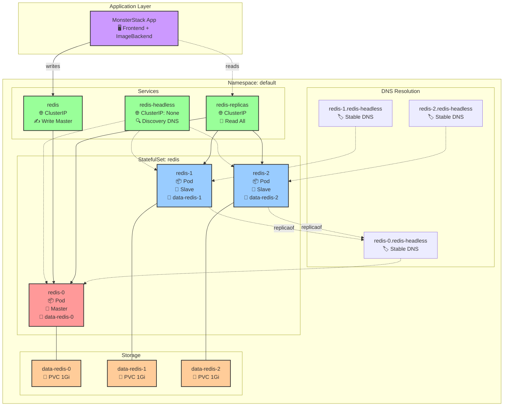

# TP : Déployer MonsterStack avec Redis en mode répliqué (StatefulSet)

## Objectifs

Dans ce TP, nous allons améliorer notre déploiement MonsterStack en remplaçant le Redis simple par un cluster Redis répliqué utilisant un StatefulSet. 

Ce qui illustrera un cas classique de déploiement stateful simple.

## Architecture cible

### Vue d'ensemble de l'application

```
┌─────────────────┐     ┌─────────────────┐     ┌─────────────────┐
│   Frontend x3   │────▶│  ImageBackend   │────▶│  Redis Cluster  │
│   (Deployment)  │     │   (Deployment)  │     │  (StatefulSet)  │
└─────────────────┘     └─────────────────┘     └─────────────────┘
                                                           │
                                                  ┌────────┼────────┐
                                                  │        │        │
                                              redis-0  redis-1  redis-2
                                              (master)  (slave)  (slave)
```

### Architecture détaillée du cluster Redis



## Comprendre les StatefulSets

Un StatefulSet est un contrôleur Kubernetes qui gère le déploiement et la mise à l'échelle d'un ensemble de Pods, avec les garanties suivantes :

- **Identité stable** : Chaque pod a un nom persistant (redis-0, redis-1, redis-2)
- **Ordre de déploiement** : Les pods sont créés et supprimés dans l'ordre
- **Stockage persistant** : Chaque pod peut avoir son propre volume persistant
- **Réseau stable** : Nom DNS stable pour chaque pod

### Pourquoi utiliser un StatefulSet pour Redis ?

Redis en mode réplication nécessite :
- Une identification stable du master (redis-0)
- Une persistance des données même après redémarrage
- Une configuration différente pour master et slaves

## Créer la ConfigMap Redis

Créez un fichier `redis-configmap.yaml` :

```yaml
apiVersion: v1
kind: ConfigMap
metadata:
  name: redis-config
  namespace: default
data:
  master.conf: |
    # Configuration du Master Redis
    bind 0.0.0.0
    protected-mode no
    port 6379
    tcp-keepalive 300
    
    daemonize no
    loglevel notice
    databases 16
    
    # Persistance
    save 900 1
    save 300 10
    save 60 10000
    stop-writes-on-bgsave-error yes
    rdbcompression yes
    rdbchecksum yes
    dbfilename dump.rdb
    dir /data
    
    # Mémoire
    maxmemory 256mb
    maxmemory-policy allkeys-lru

  slave.conf: |
    # Configuration des Replicas Redis
    bind 0.0.0.0
    protected-mode no
    port 6379
    tcp-keepalive 300
    
    daemonize no
    loglevel notice
    databases 16
    
    # Réplication - le master est toujours redis-0
    replicaof redis-0.redis-headless 6379
    slave-read-only yes
    
    dir /data
    
    # Mémoire
    maxmemory 256mb
    maxmemory-policy allkeys-lru
```

**En résumé :**
- **Deux configurations distinctes** : Une pour le master (`master.conf`) et une pour les slaves (`slave.conf`)
- **Configuration master** : Active la persistance RDB avec sauvegarde automatique (`save 900 1`, `save 300 10`, etc.) et stockage dans `/data`
- **Configuration slaves** : Contient `replicaof redis-0.redis-headless 6379` pour se connecter automatiquement au master et `slave-read-only yes` pour empêcher les écritures
- **Gestion dynamique** : L'initContainer choisit automatiquement la bonne configuration selon le nom du pod (redis-0 = master, autres = slaves)

## Créer les Services

### Service Headless pour la découverte

Créez un fichier `redis-services.yaml` :

```yaml
# Service Headless pour la découverte des pods
apiVersion: v1
kind: Service
metadata:
  name: redis-headless
  namespace: default
  labels:
    app: redis
spec:
  type: ClusterIP
  clusterIP: None  # Headless service
  ports:
    - port: 6379
      targetPort: 6379
      name: redis
  selector:
    app: redis
---
# Service pour accéder au master uniquement
apiVersion: v1
kind: Service
metadata:
  name: redis-master
  namespace: default
  labels:
    app: redis
spec:
  type: ClusterIP
  ports:
    - port: 6379
      targetPort: 6379
      name: redis
  selector:
    app: redis
    statefulset.kubernetes.io/pod-name: redis-0
---
# Service pour accéder à tous les pods (lecture répartie)
apiVersion: v1
kind: Service
metadata:
  name: redis-replicas
  namespace: default
  labels:
    app: redis
spec:
  type: ClusterIP
  ports:
    - port: 6379
      targetPort: 6379
      name: redis
  selector:
    app: redis
```

**Explications de nos services :**
- **`redis-headless`** : Service headless (`clusterIP: None`) qui permet la découverte DNS. Chaque pod Redis a son propre nom DNS stable (redis-0.redis-headless, redis-1.redis-headless, etc.). Essentiel pour la réplication car les slaves doivent pouvoir contacter directement le master par son nom DNS.
- **`redis`** : Service principal qui pointe uniquement vers redis-0 (master) via le sélecteur `statefulset.kubernetes.io/pod-name: redis-0`. Nommé simplement "redis" pour assurer la compatibilité avec l'application existante du TP 147. Toutes les écritures passent par ce service.
- **`redis-replicas`** : Service qui load-balance sur TOUS les pods Redis (master + slaves) via le sélecteur `app: redis`. Utile pour distribuer les lectures sur l'ensemble du cluster et améliorer les performances.

## Créer le StatefulSet

Créez un fichier `redis-statefulset.yaml` :

```yaml
apiVersion: apps/v1
kind: StatefulSet
metadata:
  name: redis
  namespace: default
spec:
  serviceName: redis-headless  # Service headless associé
  replicas: 3
  selector:
    matchLabels:
      app: redis
  template:
    metadata:
      labels:
        app: redis
    spec:
      initContainers:
        - name: config
          image: redis:7.2-alpine
          command:
            - sh
            - -c
            - |
              set -ex
              # Déterminer si c'est le master ou un slave
              if [ "$(hostname)" = "redis-0" ]; then
                echo "Initializing as MASTER"
                cp /mnt/config-map/master.conf /etc/redis/redis.conf
              else
                echo "Initializing as REPLICA"
                cp /mnt/config-map/slave.conf /etc/redis/redis.conf
              fi
          volumeMounts:
            - name: redis-config
              mountPath: /mnt/config-map
            - name: config
              mountPath: /etc/redis/
      containers:
        - name: redis
          image: redis:7.2-alpine
          command:
            - redis-server
            - /etc/redis/redis.conf
          ports:
            - containerPort: 6379
              name: redis
          volumeMounts:
            - name: data
              mountPath: /data
            - name: config
              mountPath: /etc/redis
          resources:
            requests:
              cpu: 100m
              memory: 128Mi
            limits:
              cpu: 500m
              memory: 512Mi
          livenessProbe:
            tcpSocket:
              port: redis
            initialDelaySeconds: 30
            periodSeconds: 10
          readinessProbe:
            exec:
              command:
                - sh
                - -c
                - redis-cli ping | grep PONG
            initialDelaySeconds: 15
            periodSeconds: 5
      volumes:
        - name: redis-config
          configMap:
            name: redis-config
        - name: config
          emptyDir: {}
  volumeClaimTemplates:
    - metadata:
        name: data
      spec:
        accessModes: ["ReadWriteOnce"]
        resources:
          requests:
            storage: 1Gi
```

**Quelques précisions sur le code:**
- **`initContainer`** : Conteneur d'initialisation qui s'exécute avant Redis. Il examine le hostname du pod (`hostname` = redis-0, redis-1, etc.) et copie la configuration appropriée (master.conf pour redis-0, slave.conf pour les autres) dans un volume partagé que le conteneur principal utilisera.
- **`volumeClaimTemplates`** : Template qui crée automatiquement un PersistentVolumeClaim (PVC) unique pour chaque pod du StatefulSet. Contrairement aux Deployments, chaque pod garde son propre stockage même après redémarrage, garantissant la persistance des données.
- **`serviceName: redis-headless`** : Relie le StatefulSet au service headless pour activer les noms DNS stables.
- **Probes de santé** : `livenessProbe` (TCP) vérifie que Redis répond, `readinessProbe` (redis-cli ping) s'assure que Redis est opérationnel avant de recevoir du trafic.

## Mettre à jour l'application

L'application peut continuer à utiliser le service `redis` sans modification, car il pointe automatiquement vers le master :

```yaml
# Dans frontend.yaml et imagebackend.yaml (inchangé depuis le TP 147)
env:
  - name: REDIS_HOST
    value: "redis"  # Pointe vers le master (redis-0) pour les écritures
  - name: REDIS_PORT
    value: "6379"
```

## Déployer l'application

```bash
# Créer le namespace si nécessaire
kubectl create namespace default

# Déployer Redis StatefulSet
kubectl apply -f redis-configmap.yaml
kubectl apply -f redis-services.yaml
kubectl apply -f redis-statefulset.yaml

# Attendre que les pods Redis soient prêts
kubectl wait --for=condition=ready pod -l app=redis --timeout=300s

# Déployer le reste de l'application
kubectl apply -f frontend.yaml
kubectl apply -f imagebackend.yaml
kubectl apply -f monsterstack-ingress.yaml
```

## Vérifier le déploiement

### Vérifier les pods

```bash
# Voir l'ordre de création des pods
kubectl get pods -l app=redis -w

# Vérifier les noms stables
kubectl get pods -l app=redis
# Doit afficher : redis-0, redis-1, redis-2
```

### Vérifier la réplication

```bash
# Se connecter au master
kubectl exec -it redis-0 -- redis-cli

# Dans redis-cli, vérifier le statut
127.0.0.1:6379> INFO replication
# Doit montrer role:master et 2 connected_slaves

# Tester l'écriture sur le master
127.0.0.1:6379> SET test "Hello from master"
127.0.0.1:6379> exit

# Vérifier la réplication sur un slave
kubectl exec -it redis-1 -- redis-cli GET test
# Doit retourner "Hello from master"
```

### Vérifier les services

```bash
# Vérifier les endpoints
kubectl get endpoints redis-headless
kubectl get endpoints redis
kubectl get endpoints redis-replicas

# Tester la résolution DNS
kubectl run -it --rm debug --image=alpine --restart=Never -- nslookup redis-0.redis-headless
```

## Tester la persistance

```bash
# Créer des données
kubectl exec -it redis-0 -- redis-cli SET persistent "data"

# Supprimer le pod master
kubectl delete pod redis-0

# Attendre la recréation
kubectl wait --for=condition=ready pod/redis-0 --timeout=120s

# Vérifier que les données sont toujours là
kubectl exec -it redis-0 -- redis-cli GET persistent
# Doit retourner "data"
```

## Scaler le StatefulSet

```bash
# Augmenter le nombre de replicas
kubectl scale statefulset redis --replicas=5

# Observer l'ordre de création
kubectl get pods -l app=redis -w

# Réduire
kubectl scale statefulset redis --replicas=3

# Observer l'ordre de suppression (inverse)
kubectl get pods -l app=redis -w
```

### Limitations et considérations

1. **Failover manuel** : Si redis-0 tombe, pas de promotion automatique
3. **Performance** : Les slaves sont en lecture seule


On pourrait installer un opérateur Redis pour avoir une solution plus avancée. Il faudrait également se préocuper du monitoring et backup de ce Redis